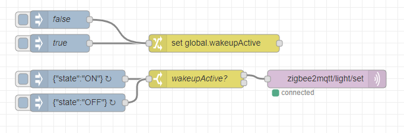
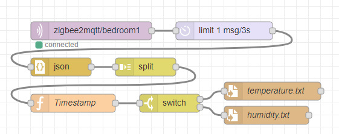
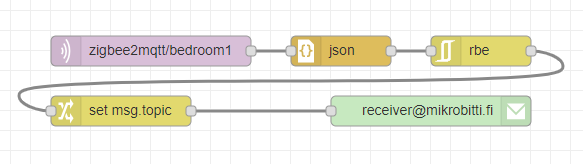
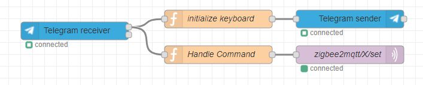
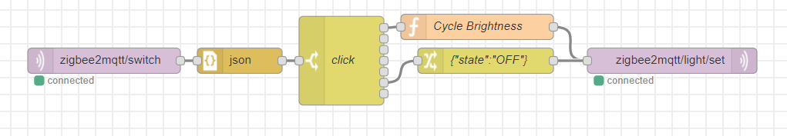
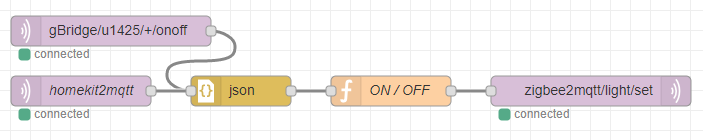
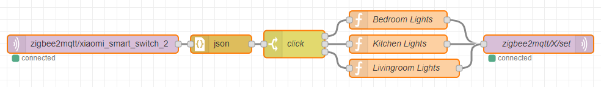

# Node-RED -esimerkkivirrat

Tästä hakemistosta löydät artikkelin esimerkkivirrat json-muodossa.

Voit viedä ne omaan Node-RED:iisi kopioimalla json-merkkijonon leikepöydälle ja sitten valitsemalla Node-RED:in valikosta `Import -> Clipboard`.

## Node-REDin lyhyt oppimäärä

### [1. Yksinkertainen herätysvalo](flows/1-heratysvalo.json)

### [2. Anturidata talteen](flows/2-anturidata-talteen.json)

### [3. Hälytys sähköpostiin](flows/3-email-halytys.json)

### [4. Telegram-kaukosäädin](flows/4-telegram-kaukosaadin.json)

## Zigbee-laitteet osaksi järjestelmää

### [5. Trådfri-lampun ohjaus Xiaomin älynapilla](flows/5-xiaomi-napilla-lamppu-paalle.json)

## Ääniohjaus tekoälyassistentilla

### [6. Gbridge ja HomeKit -integraatiot](flows/6-gbridge-homekit-aaniohjaus.json)

## Extra

### [7. Xiaomi-kytkimen tilan lukeminen](flows/7-kytkimen-tilan-lukeminen.json)

